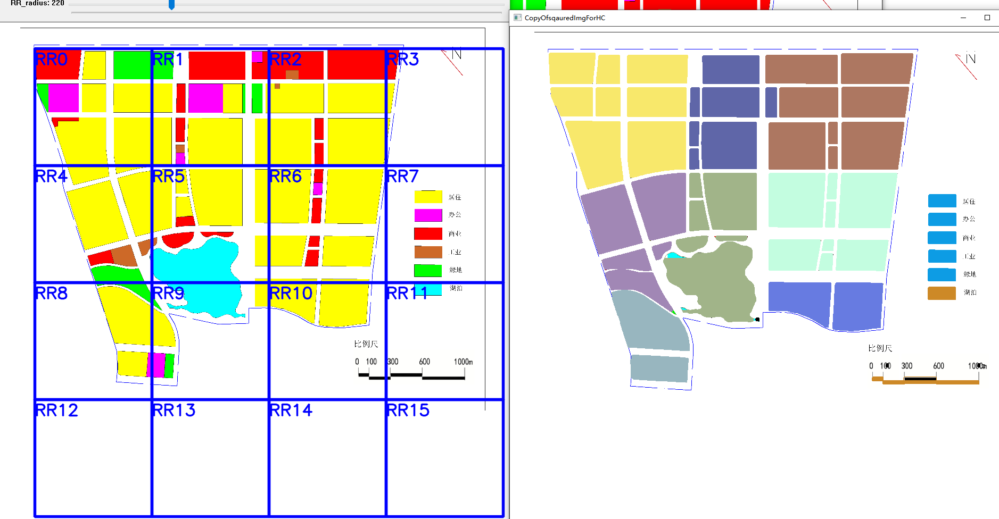
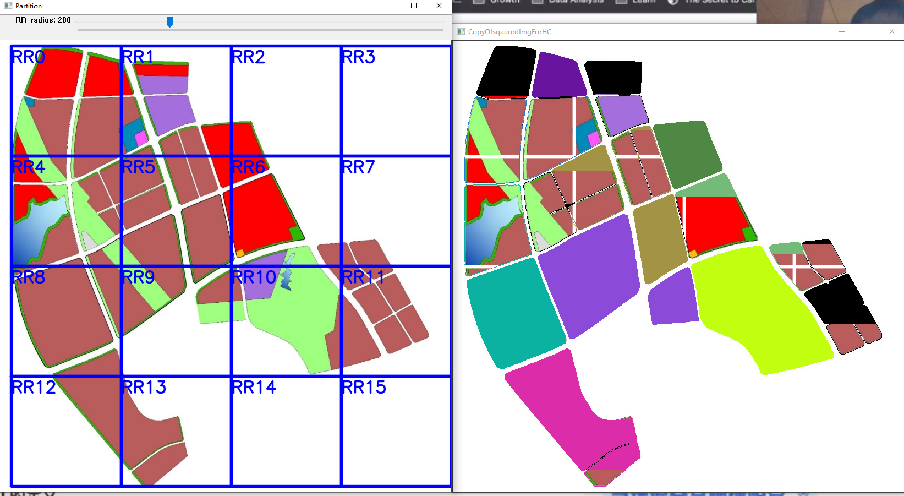

# OpenCV-Python Tutorials 


## 安装

anaconda全家桶


国内镜像加速

https://blog.csdn.net/sinat_21591675/article/details/82770360

用阿里的


使用pip之前新建一个C:\Users\lenovo\pip\pip.ini

[global]

index-url = http://mirrors.aliyun.com/pypi/simple/

[install]

trusted-host = mirrors.aliyun.com


安装 

pip install opencv-python==4.5.1.48

pip install opencv-contrib-python==4.5.1.48

设置jupyter-notebook的root为我们的代码根目录，在jupyter启动的快捷方式里修改 目标


启动jupyter开始欢快的玩耍！


## 代码笔记

6-16 开始按照官网的教程来用python实现需求3，适当了解一些基本的python语法

[编码规范](https://www.runoob.com/w3cnote/google-python-styleguide.html)

[Code Cheat Sheet](opencv-tutorial-md/CodeCheatSheet.md)

[1GuiFeaturesTrackBar.ipynb](http://localhost:8888/notebooks/opencv-tutorial-md/1GuiFeaturesTrackBar.ipynb)

[2Core.ipynb](http://localhost:8888/notebooks/opencv-tutorial-md/2Core.ipynb)

[3ImageProcessCannyEdges.ipynb](http://localhost:8888/notebooks/opencv-tutorial-md/3ImageProcessCannyEdges.ipynb)

[3ImageProcessMorphological.ipynb](http://localhost:8888/notebooks/opencv-tutorial-md/3ImageProcessMorphological.ipynb)

[3ImageProcessTemplateMatch.ipynb](http://localhost:8888/notebooks/opencv-tutorial-md/3ImageProcessTemplateMatch.ipynb)

[3ImageProcessThresholdSmooth.ipynb](http://localhost:8888/notebooks/opencv-tutorial-md/3ImageProcessThresholdSmooth.ipynb)

[3ImageProcessWaterSehed.ipynb](http://localhost:8888/notebooks/opencv-tutorial-md/3ImageProcessWaterSehed.ipynb)


6-19 出基本成果 python YYDS

[Partition2ShootingStar.ipynb](http://localhost:8888/notebooks/hotcold/Partition2ShootingStar.ipynb)

还有些bug，不过冷热分区，合并分区到同一个冷热分区的初步架子已经成型。


## 参考官方教程

- [Introduction to OpenCV](https://docs.opencv.org/4.5.2/da/df6/tutorial_py_table_of_contents_setup.html)

  Learn how to setup OpenCV-Python on your computer!

  直接用anaconda，跳过

  入门Py常用资料：

1. A Quick guide to Python - [A Byte of Python](http://swaroopch.com/notes/python/)
2. [NumPy Quickstart tutorial](https://numpy.org/devdocs/user/quickstart.html)
3. [NumPy Reference](https://numpy.org/devdocs/reference/index.html#reference)
4. [OpenCV Documentation](http://docs.opencv.org/)
5. [OpenCV Forum](https://forum.opencv.org/)


- [Gui Features in OpenCV](https://docs.opencv.org/4.5.2/dc/d4d/tutorial_py_table_of_contents_gui.html)

  Here you will learn how to display and save images and videos, control mouse events and create trackbar.

  这里最有用的就是这个trackbar了，因为我们需要它来自动变换框选的矩形的长度，这样就可以可视化的验证我们的理论了。冷热分区和电力分区，都可以在图上动态的标记出来或者渲染出来。

  ~~我们还可以尝试添加更多的空例如，重置按钮，预处理展示按钮，也就是不同的模式了。Button需要QT，直接放弃，安装QT很耗时~~
  
  那就将图片预处理了，保存下来，然后我们基于预处理的图片进行操作
  
  状态：100%


- [Core Operations](https://docs.opencv.org/4.5.2/d7/d16/tutorial_py_table_of_contents_core.html)

  In this section you will learn basic operations on image like pixel editing, geometric transformations, code optimization, some mathematical tools etc.

状态：100% 必须掌握 numpy matplotlib


- [Image Processing in OpenCV](https://docs.opencv.org/4.5.2/d2/d96/tutorial_py_table_of_contents_imgproc.html)

  In this section you will learn different image processing functions inside OpenCV.

状态：100%





- [Feature Detection and Description](https://docs.opencv.org/4.5.2/db/d27/tutorial_py_table_of_contents_feature2d.html)

  In this section you will learn about feature detectors and descriptors

- [Video analysis (video module)](https://docs.opencv.org/4.5.2/da/dd0/tutorial_table_of_content_video.html)

  In this section you will learn different techniques to work with videos like object tracking etc.

- [Camera Calibration and 3D Reconstruction](https://docs.opencv.org/4.5.2/d9/db7/tutorial_py_table_of_contents_calib3d.html)

  In this section we will learn about camera calibration, stereo imaging etc.

- [Machine Learning](https://docs.opencv.org/4.5.2/d6/de2/tutorial_py_table_of_contents_ml.html)

  In this section you will learn different image processing functions inside OpenCV.

- [Computational Photography](https://docs.opencv.org/4.5.2/d0/d07/tutorial_py_table_of_contents_photo.html)

  In this section you will learn different computational photography techniques like image denoising etc.

- [Object Detection (objdetect module)](https://docs.opencv.org/4.5.2/d2/d64/tutorial_table_of_content_objdetect.html)

  In this section you will learn object detection techniques like face detection etc.

- [OpenCV-Python Bindings](https://docs.opencv.org/4.5.2/df/da2/tutorial_py_table_of_contents_bindings.html)

  In this section, we will see how OpenCV-Python bindings are generated 


## 框架 Tensorflow/Keras/PyTorch

看看这些DL的框架能不能有些帮助，貌似都在做预测和分类识别，对目前的需求没有，可能后期的OCR会有帮助，就是做识别的。

[Tensorflow2](tensorflow/Tensorflow2.md)

[手撸神经网络](https://www.bilibili.com/video/BV1m4411x7KU/?spm_id_from=333.788.recommend_more_video.5)，有利于全局的理解神经网络和熟悉numpy的高级用法

[Keras](tensorflow/Keras.md)

[Keras英语视频 练习相关专业的口语和听力](https://www.bilibili.com/video/BV1g64y1S7Kz/?spm_id_from=333.788.recommend_more_video.1)

[PyTorch](tensorflow/PyTorch.md)


## 输出地块色块面积和父子关系

```json
{
    "area":50000, /*最外面的是总面积*/
    "data":[ /*data是地块的信息*/
        {
            "area":330,
            "color":"(255,255,255)",
            "points":[
                {
                    "xAxis":22.4,
                    "yAxis":44.34
                }
            ],
            "children":[ /*children是色块的信息*/
                {
                    "area":330,
                    "color":"(255,255,255)",
                    "points":[
                        {
                            "xAxis":22.4,
                            "yAxis":44.34
                        }
                    ]
                }
            ]
        }
    ]
}
```


比如蓝色框出来的就是地块

然后绿色框出来的是色块


学习opencv3中文版 

第14章 轮廓  canny是布尔矩阵 findContours将canny的布尔矩阵转换成坐标形式的矩阵

307 - Canny 的threashold怎么计算 

https://www.bilibili.com/video/BV1QJ411W7SS?p=45

https://www.bilibili.com/video/BV1QJ411W7SS?p=46

图像处理、分析与机器视觉  

全部


## road detection/ Extract road from map / aerial image / satellite image

回到道路检测的问题上来

https://stackoverflow.com/questions/62623836/simple-way-to-detect-street-area-in-google-map-images-aerial-images

https://www.cs.toronto.edu/~hinton/absps/road_detection.pdf

https://towardsdatascience.com/satellite-coasts-detection-model-with-python-and-opencv-28d1b4b8474e


## 按照颜色提取思路

根据分割线的颜色，找出图上画好的蓝色分割线的点，生成一张和原图大小一样的mask，然后可以是fillConvexPoly填充为roi mask，

也可以是[poylines](https://docs.opencv.org/3.4/dc/da5/tutorial_py_drawing_functions.html)  这样抠图，提取轮廓都是可以的

分割线的设定也可以很好的用来将图片分割和分类，不同的分割线可以代表不同的作用


颜色除了当线条使用，还可以当作roi来使用，inRange(src, lower, upper),轻松得到一个roi的mask


还可以尝试[comparehist](https://docs.opencv.org/3.4/d8/dc8/tutorial_histogram_comparison.html)


## RESTAPI

[fastapi](https://fastapi.tiangolo.com/zh/) python界的springboot

### 开发环境准备：

由于默认conda环境装的东西太多了，我们新建一个venv，[参考](https://zhuanlan.zhihu.com/p/141122337)

```
conda create --name mtcv python=3.9 
activate mtcv
conda env list
conda activate mtcv
```


#### 手动安装依赖：

我们自己的安装命令流程

```
pip install fastapi uvicorn opencv-python==4.5.1.48 opencv-contrib-python==4.5.1.48

# 启动
uvicorn main:app --reload
```

### docker

putty

```
# psftp
open host_name
# 单个文件
put D:/anaconda3/pycv-sample/mtcv/Dockerfile /zhny2.0/mtcv/Dockerfile 
# 目录
put -r D:/anaconda3/pycv-sample/mtcv/ /zhny2.0/mtcv/
```

[psftp 参考](https://jingyan.baidu.com/article/d169e18658995a436611d8ee.html)


```
# 端口检查
lsof -i tcp:8001
# 系统信息 
uname -a
lsb_release -a

```

[linux 系统信息参考](https://jingyan.baidu.com/article/7908e85c725159af481ad2f7.html)


```
/etc/docker/daemon.json

{"registry-mirrors":["https://reg-mirror.qiniu.com/"]}

$ sudo systemctl daemon-reload
$ sudo systemctl restart docker
```

[镜像加速参考](https://www.runoob.com/docker/docker-mirror-acceleration.html)


```dockerfile
FROM python:3.9

RUN pip install fastapi uvicorn opencv-python==4.5.1.48 opencv-contrib-python==4.5.1.48

EXPOSE 8000

COPY ./ /

CMD ["uvicorn", "main:app", "--host", "0.0.0.0", "--port", "8000"]
```


```shell
# 删除之前无用的镜像
docker images
docker rmi -f 50fa88577b3c
docker rmi -f mtcv

# 删除之前无用的容器
docker ps -a
docker rm -f de74e81dc74f
docker rm -f mtcv

# build and run
docker build -t mtcv .
# 后台启动
docker run -d --name mtcv -p 8001:8000 mtcv
# 测试用启动
docker run --rm --name mtcv -p 8001:8000 mtcv
```

[docker 参考](https://fastapi.tiangolo.com/zh/deployment/docker/)


```
# 查看启动失败日志
docker logs -f mtcv
```

[docker 日志查询](https://www.runoob.com/docker/docker-container-usage.html)


```
# File "/usr/local/lib/python3.9/site-packages/cv2/__init__.py", line 5, in <module>
#    from .cv2 import *
# ImportError: libGL.so.1: cannot open shared object file: No such file or directory

# RUN apt install libgl1-mesa-glx -y
RUN apt-get install 'ffmpeg'\
    'libsm6'\
    'libxext6'  -y
```

[libGL参考 1](https://stackoverflow.com/questions/63889102/unable-to-run-docker-image-due-to-libgl-error)

[libGL参考 2](https://stackoverflow.com/questions/55313610/importerror-libgl-so-1-cannot-open-shared-object-file-no-such-file-or-directo)


todo：缺少快捷查看日志的功能

todo：增加requirements.txt简化Dockerfile

todo: 将固定的依赖打成一个image，这样不用每次都下载

todo:返回值的形式是否可以改一下 

```
{
"xAxis": 727,
"yAxis": 2027
},
# 改成
{
"x": 727,
"y": 2027
},
# 或者 0 - x, 1 - y
[727, 2027]
```


接口文档：

http://127.0.0.1:8000/docs

http://127.0.0.1:8000/redoc


