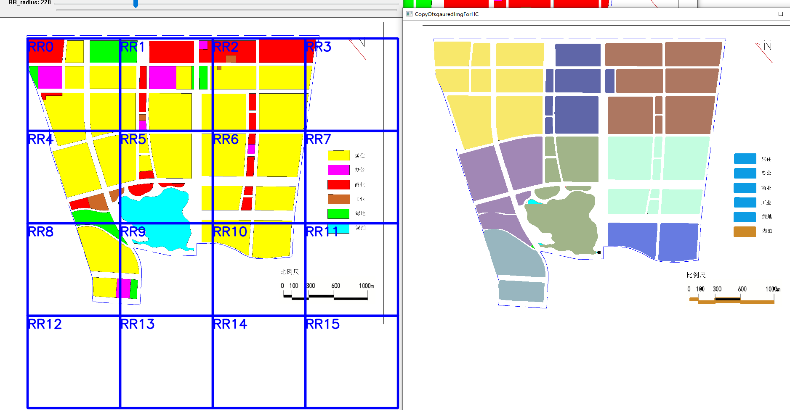

# OpenCV

## 环境安装

### anaconda全家桶


#### 国内镜像加速

https://blog.csdn.net/sinat_21591675/article/details/82770360

用阿里的

使用pip之前新建一个C:\Users\lenovo\pip\pip.ini

```
[global]
index-url = http://mirrors.aliyun.com/pypi/simple/
[install]
trusted-host = mirrors.aliyun.com
```

#### 安装依赖

```
pip install opencv-python==4.5.1.48 opencv-contrib-python==4.5.1.48
```

#### 设置jupyter启动根目录

设置jupyter-notebook的root为我们的代码根目录，在jupyter启动的快捷方式里修改 目标


启动jupyter开始欢快的玩耍！


## 参考官方教程

[Code Cheat Sheet](opencv_py/CodeCheatSheet.md)

[1GuiFeaturesTrackBar.ipynb](http://localhost:8888/notebooks/opencv-tutorial-md/1GuiFeaturesTrackBar.ipynb)

[2Core.ipynb](http://localhost:8888/notebooks/opencv-tutorial-md/2Core.ipynb)

[3ImageProcessCannyEdges.ipynb](http://localhost:8888/notebooks/opencv-tutorial-md/3ImageProcessCannyEdges.ipynb)

[3ImageProcessMorphological.ipynb](http://localhost:8888/notebooks/opencv-tutorial-md/3ImageProcessMorphological.ipynb)

[3ImageProcessTemplateMatch.ipynb](http://localhost:8888/notebooks/opencv-tutorial-md/3ImageProcessTemplateMatch.ipynb)

[3ImageProcessThresholdSmooth.ipynb](http://localhost:8888/notebooks/opencv-tutorial-md/3ImageProcessThresholdSmooth.ipynb)

[3ImageProcessWaterSehed.ipynb](http://localhost:8888/notebooks/opencv-tutorial-md/3ImageProcessWaterSehed.ipynb)


6-19 出基本成果 python YYDS

[Partition2ShootingStar.ipynb](http://localhost:8888/notebooks/hotcold/Partition2ShootingStar.ipynb)

还有些bug，不过冷热分区，合并分区到同一个冷热分区的初步架子已经成型。


- [Introduction to OpenCV](https://docs.opencv.org/4.5.2/da/df6/tutorial_py_table_of_contents_setup.html)

  Learn how to setup OpenCV-Python on your computer!

  直接用anaconda，跳过

  入门Py常用资料：

1. A Quick guide to Python - [A Byte of Python](http://swaroopch.com/notes/python/)
2. [NumPy Quickstart tutorial](https://numpy.org/devdocs/user/quickstart.html)
3. [NumPy Reference](https://numpy.org/devdocs/reference/index.html#reference)
4. [OpenCV Documentation](http://docs.opencv.org/)
5. [OpenCV Forum](https://forum.opencv.org/)


- [Gui Features in OpenCV](https://docs.opencv.org/4.5.2/dc/d4d/tutorial_py_table_of_contents_gui.html)

  Here you will learn how to display and save images and videos, control mouse events and create trackbar.

  这里最有用的就是这个trackbar了，因为我们需要它来自动变换框选的矩形的长度，这样就可以可视化的验证我们的理论了。冷热分区和电力分区，都可以在图上动态的标记出来或者渲染出来。

  ~~我们还可以尝试添加更多的空例如，重置按钮，预处理展示按钮，也就是不同的模式了。Button需要QT，直接放弃，安装QT很耗时~~

  那就将图片预处理了，保存下来，然后我们基于预处理的图片进行操作

  状态：100%


- [Core Operations](https://docs.opencv.org/4.5.2/d7/d16/tutorial_py_table_of_contents_core.html)

  In this section you will learn basic operations on image like pixel editing, geometric transformations, code optimization, some mathematical tools etc.

状态：100% 必须掌握 numpy matplotlib


- [Image Processing in OpenCV](https://docs.opencv.org/4.5.2/d2/d96/tutorial_py_table_of_contents_imgproc.html)

  In this section you will learn different image processing functions inside OpenCV.

状态：100%




- [Feature Detection and Description](https://docs.opencv.org/4.5.2/db/d27/tutorial_py_table_of_contents_feature2d.html)

  In this section you will learn about feature detectors and descriptors

- [Video analysis (video module)](https://docs.opencv.org/4.5.2/da/dd0/tutorial_table_of_content_video.html)

  In this section you will learn different techniques to work with videos like object tracking etc.

- [Camera Calibration and 3D Reconstruction](https://docs.opencv.org/4.5.2/d9/db7/tutorial_py_table_of_contents_calib3d.html)

  In this section we will learn about camera calibration, stereo imaging etc.

- [Machine Learning](https://docs.opencv.org/4.5.2/d6/de2/tutorial_py_table_of_contents_ml.html)

  In this section you will learn different image processing functions inside OpenCV.

- [Computational Photography](https://docs.opencv.org/4.5.2/d0/d07/tutorial_py_table_of_contents_photo.html)

  In this section you will learn different computational photography techniques like image denoising etc.

- [Object Detection (objdetect module)](https://docs.opencv.org/4.5.2/d2/d64/tutorial_table_of_content_objdetect.html)

  In this section you will learn object detection techniques like face detection etc.

- [OpenCV-Python Bindings](https://docs.opencv.org/4.5.2/df/da2/tutorial_py_table_of_contents_bindings.html)

  In this section, we will see how OpenCV-Python bindings are generated 