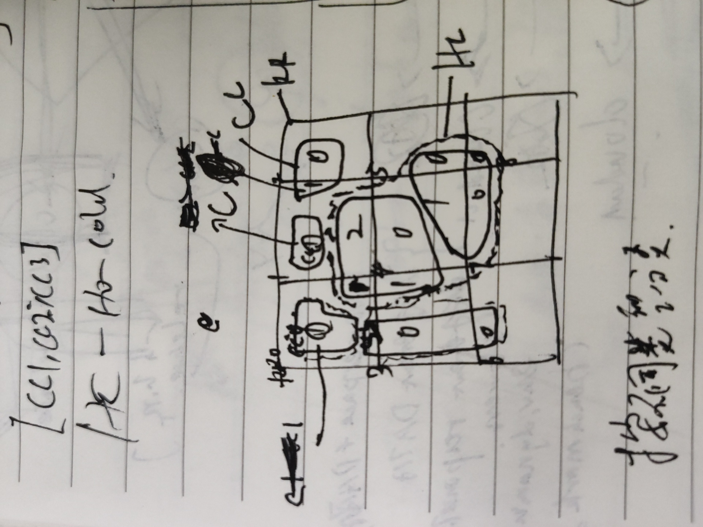

```python
# original contour size 6
# we can the original contour by using canny and findContours(external)
OCNT = ['CNT0', 'CNT1', 'CNT2', 'CNT3','CNT4', 'CNT5']

# RR size 9
# we can calculate RR by radius, ex raidus = 300, img(900,900)
# drwa 9 rectangle(square), as a 3*3 square
RR = ['RR0', 'RR1', 'RR2', 'RR3', 'RR4', 'RR5', 'RR6', 'RR7', 'RR8', 'RR9']

# group Chunked contour by RR
# using RR square a sliding window, so using the RR window to get chunked contours
# by canny and findContours(external)
RRCC = [['RR0-CC0','RR0-CC1','RR0-CC2'],\
      ['RR1-CC0','RR0-CC1','RR0-CC2'],\
      ['RR2-CC0'],\
      ['RR3-CC0','RR0-CC1'],\
      ['RR4-CC0','RR0-CC1'],\
      ['RR5-CC0'],\
      ['RR6-CC0'],\
      ['RR7-CC0'],\
      ['RR8-CC0'],\
       ]

# group Chunked contour by original contour
# orginal contour should include chunked contour
# if a chunedContour could intersect with a original contour, 
# then the chunkedContour belongs to the original contour
CNTCC = [['CNT0-RR0-CC0-Area100'],\
       ['CNT1-RR1-CC0-Area100'],\
       ['CNT2-RR1-CC1-Area80', 'CNT2-RR2-CC0-Area20'],\
       ['CNT3-RR0-CC2-Area10', 'CNT3-RR3-CC0-Area80', 'CNT3-RR6-CC0-Area10'],\
       ['CNT4-RR0-CC1-Area10', 'CNT4-RR1-CC2-Area20', 'CNT4-RR3-CC1-Area20', 'CNT4-RR4-CC0-Area50'],\
       ['CNT5-RR4-CC1-Area60', 'CNT5-RR5-CC0-Area20', 'CNT5-RR7-CC0-Area15', 'CNT5-RR8-CC0-Area5'],\
      ]

# HotColdRegion is the result based on above data
# group Chunked contour by HotColdRegion
# The biggest Chunked contour in the Original Contour is the HoldCodeRegion's root
# the other Chunked contours will be the root's leaf  or leaves
HCCC = [['HC0-RR0-CC0-Area100'],\
       ['HC1-RR1-CC0-Area100'],\
       ['HC2-RR1-CC1-Area80', 'HC2-RR2-CC0-Area20'],\
       ['HC3-RR0-CC2-Area10', 'HC3-RR3-CC0-Area80', 'HC3-RR6-CC0-Area10'],\
       ['HC4-RR0-CC1-Area10', 'HC4-RR1-CC2-Area20', 'HC4-RR3-CC1-Area20', 'HC4-RR4-CC0-Area50',\
       'HC4-RR4-CC1-Area60', 'HC4-RR5-CC0-Area20', 'HC4-RR7-CC0-Area15', 'HC4-RR8-CC0-Area5'],\
      ]

# group original contour by HotColdRegion
HCCC = [['HC0-CNT0'],\
       ['HC1-CNT1'],\
       ['HC2-CNT2'],\
       ['HC3-CNT3'],\
       ['HC4-CNT4', 'HC4-CNT5'],\
      ]
```

